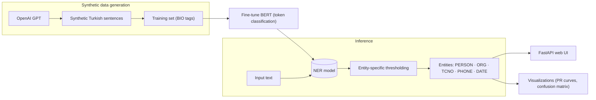

# 🤖 NER + AI Text Generation

<p>
  
  
  
  
  
  
</p>

> **Turkish Named-Entity Recognition (NER) & AI text-generation platform** — fine-tuned BERT
> with entity-specific threshold optimization, a FastAPI web UI, OpenAI GPT-based synthetic
> data generation, and rich evaluation/visualization tools.

An advanced Turkish Named-Entity Recognition (NER) and AI-assisted sentence-generation
platform. It combines a fine-tuned BERT model, entity-specific threshold optimization, a
FastAPI web interface, OpenAI GPT integration, and comprehensive visualization tools.

---

## 📋 Table of Contents
- [🎯 Overview](#-overview)
- [✨ Features](#-features)
- [🚀 Installation](#-installation)
- [💻 Usage](#-usage)
- [📁 Project Structure](#-project-structure)

---

## 🎯 Overview
This project provides a state-of-the-art Turkish NER system:
- ✅ Entity-specific threshold optimization
- 🌐 Interactive web interface (FastAPI)
- 🤖 Synthetic sentence generation with OpenAI GPT
- 🐳 Easy deployment with Docker
- 📊 Comprehensive evaluation and visualization tools

It is designed for researchers, developers, and organizations that need advanced NER
capabilities.

---

## ✨ Features
- **🧠 Fine-tuned BERT NER**: recognizes PERSON, ORG, TCNO, PHONE and DATE entities in Turkish text
- **🎯 Entity-specific thresholding**: precision/recall optimization per entity type
- **🌐 FastAPI web interface**: a user-friendly, interactive NER and text-generation app
- **🤖 OpenAI GPT integration**: generates realistic synthetic Turkish sentences
- **📊 Visualization tools**: PR curves, confusion matrices and threshold analyses
- **🐳 Docker support**: seamless deployment in any environment

---

## 🏗️ Architecture



---

## 🚀 Installation

1. **Clone the repository:**
   ```bash
   git clone https://github.com/yagmurtncr/Ner-Ai-Project.git
   cd Ner-Ai-Project
   ```

2. **Create a virtual environment (recommended):**
   ```bash
   python -m venv ner-env
   ner-env\Scripts\activate     # Windows
   # or
   source ner-env/bin/activate  # Linux/Mac
   ```

3. **Install dependencies:**
   ```bash
   pip install -r requirements.txt
   ```

4. **Set your OpenAI API key:**
   ```bash
   # create a .env file and add your API key
   echo "OPENAI_API_KEY=your_api_key_here" > .env
   ```

5. **Run with Docker (optional):**
   ```bash
   docker-compose up --build
   ```

---

## 💻 Usage

### 1. 🌐 Start the web interface
```bash
uvicorn app:app --reload
```
- Open [http://localhost:8000](http://localhost:8000) in your browser
- Enter text, view the detected entities, and generate synthetic sentences

### 2. 📊 Model evaluation
```bash
python evaluate.py
```
- Results are saved to the `visual_results/` folder

### 3. 🎓 Model training
```bash
python train_model.py
```

### 4. 🔧 Data-processing tools
```bash
# balance the dataset
python data_utils/balanced_data.py

# convert CoNLL to CSV
python data_utils/convert_conll_to_csv.py

# generate fake TC-ID / phone numbers
python data_utils/generate_fake_tc_num.py
```

---

## 📁 Project Structure
```
Ner-Ai-Project/
├── 📄 app.py                     # FastAPI web interface and backend
├── 📄 evaluate.py                # Model evaluation and threshold analysis
├── 📄 train_model.py             # Model training script
├── 📄 postprocess.py             # NER result post-processing
├── 📄 preprocess.py              # Data preprocessing
├── 📁 data_utils/                # Data-processing tools
│   ├── balanced_data.py          # dataset balancing
│   ├── convert_conll_to_csv.py   # CoNLL → CSV conversion
│   ├── openai_bio_generator.py   # data generation with OpenAI
│   └── generate_fake_tc_num.py   # fake TC-ID / phone generation
├── 📁 templates/                 # HTML templates
├── 📁 tests/                     # unit tests (checksum, BIO, postprocessing)
├── 📄 requirements.txt           # Python dependencies
├── 📄 Dockerfile                 # Docker configuration
└── 📄 docker-compose.yml         # Docker Compose configuration
```

---

## 🧪 Tests & CI

```bash
ruff check .     # lint
pytest -q        # unit tests (TC-ID checksum, BIO tagging, NER post-processing)
```

GitHub Actions runs `ruff` + `pytest` on every push and pull request.

---

## 📄 License

Released under the [MIT License](LICENSE).
