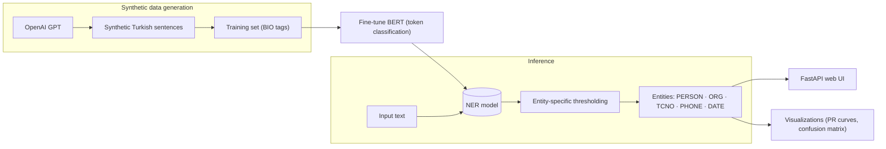

# 🤖 NER + AI Text Generation

<p>
  
  
  
  
  
  
</p>

> **Turkish Named-Entity Recognition (NER) & AI text generation platform** — fine-tuned BERT
> with entity-specific threshold optimization, a FastAPI web UI, OpenAI GPT-based synthetic
> data generation, and rich evaluation/visualization tools. *Documentation below is in Turkish.*

Türkçe metinler için gelişmiş Varlık İsmi Tanıma (NER) ve yapay zeka destekli cümle üretim platformu. Fine-tuned BERT modeli, varlık-spesifik eşik optimizasyonu, FastAPI web arayüzü, OpenAI GPT entegrasyonu ve kapsamlı görselleştirme araçları içerir.

---

## 📋 İçindekiler
- [🎯 Genel Bakış](#genel-bakış)
- [✨ Özellikler](#özellikler)
- [🚀 Kurulum](#kurulum)
- [💻 Kullanım](#kullanım)
- [📁 Klasör Yapısı](#klasör-yapısı)

---

## 🎯 Genel Bakış
Bu proje son teknoloji Türkçe NER sistemi sunar:
- ✅ Varlık-spesifik eşik optimizasyonu
- 🌐 Etkileşimli web arayüzü (FastAPI)
- 🤖 OpenAI GPT ile sentetik cümle üretimi
- 🐳 Docker ile kolay dağıtım
- 📊 Kapsamlı değerlendirme ve görselleştirme araçları

Araştırmacılar, geliştiriciler ve gelişmiş NER yetenekleri arayan kurumlar için tasarlanmıştır.

---

## ✨ Özellikler
- **🧠 Fine-tuned BERT NER**: Türkçe metinlerde PERSON, ORG, TCNO, PHONE ve DATE varlıklarını tanır
- **🎯 Varlık-spesifik Eşikleme**: Her varlık türü için precision/recall optimizasyonu
- **🌐 FastAPI Web Arayüzü**: Kullanıcı dostu, etkileşimli NER ve metin üretim uygulaması
- **🤖 OpenAI GPT Entegrasyonu**: Gerçekçi, sentetik Türkçe cümleler üretir
- **📊 Görselleştirme Araçları**: PR eğrileri, karmaşıklık matrisleri ve eşik analizleri
- **🐳 Docker Desteği**: Herhangi bir ortamda sorunsuz dağıtım

---

## 🏗️ Mimari (Architecture)



---

## 🚀 Kurulum

1. **Depoyu klonlayın:**
   ```bash
   git clone https://github.com/yagmurtncr/Ner-Ai-Project.git
   cd Ner-Ai-Project
   ```

2. **Sanal ortam oluşturun (önerilen):**
   ```bash
   python -m venv ner-env
   ner-env\Scripts\activate    # Windows
   # veya
   source ner-env/bin/activate  # Linux/Mac
   ```

3. **Bağımlılıkları yükleyin:**
   ```bash
   pip install -r requirements.txt
   ```

4. **OpenAI API anahtarını ayarlayın:**
   ```bash
   # .env dosyası oluşturun ve API anahtarınızı ekleyin
   echo "OPENAI_API_KEY=your_api_key_here" > .env
   ```

5. **Docker ile çalıştırın (isteğe bağlı):**
   ```bash
   docker-compose up --build
   ```

---

## 💻 Kullanım

### 1. 🌐 Web Arayüzünü Başlatın
```bash
uvicorn app:app --reload
```
- Tarayıcınızda [http://localhost:8000](http://localhost:8000) adresini açın
- Metin girin, tespit edilen varlıkları görün ve sentetik cümleler oluşturun

### 2. 📊 Model Değerlendirmesi  
```bash
python evaluate.py
```
- Sonuçlar `visual_results/` klasörüne kaydedilir

### 3. 🎓 Model Eğitimi
```bash
python train_model.py
```

### 4. 🔧 Veri İşleme Araçları
```bash
# Veri dengeleme
python data_utils/balanced_data.py

# ConLL'den CSV'ye dönüştürme  
python data_utils/convert_conll_to_csv.py

# Sahte TC/telefon numarası üretme
python data_utils/generate_fake_tc_num.py
```

---

## 📁 Klasör Yapısı
```
Ner_Project/
├── 📄 app.py                 # FastAPI web arayüzü ve backend
├── 📄 evaluate.py            # Model değerlendirmesi ve eşik analizi  
├── 📄 train_model.py         # Model eğitimi scripti
├── 📄 postprocess.py         # NER sonuçları işleme
├── 📄 preprocessing.py       # Veri ön işleme
├── 📁 data_utils/            # Veri işleme araçları
│   ├── balanced_data.py      # Veri dengeleme
│   ├── convert_conll_to_csv.py # ConLL → CSV dönüştürme
│   ├── openai_bio_generator.py # OpenAI ile veri üretme
│   └── generate_fake_tc_num.py # Sahte TC/telefon üretme
├── 📁 templates/             # HTML şablonları
├── 📁 raw_data/              # Ham ve işlenmiş veri dosyaları
├── 📄 requirements.txt       # Python bağımlılıkları
├── 📄 Dockerfile             # Docker yapılandırması
└── 📄 docker-compose.yml     # Docker Compose yapılandırması
```

---


